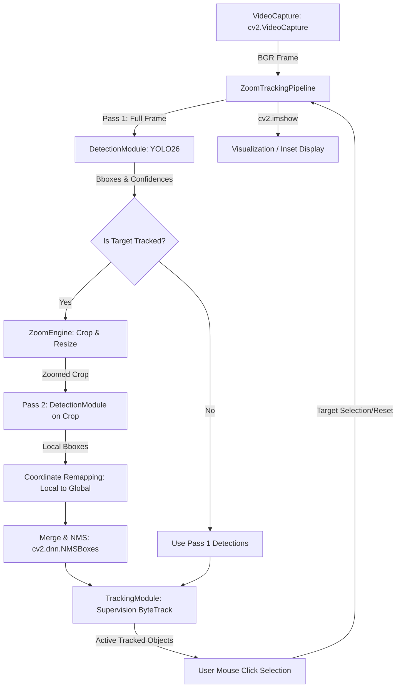

# Monocular Zoom-Tracking Pipeline with YOLO26 & ByteTrack

An end-to-end, high-performance, single-threaded **monocular zoom-tracking pipeline** designed to dynamically center and magnify target objects (webcams, local video files, or RTSP feeds). The system uses the target's relative bounding box area as a depth proxy, applying an Exponential Moving Average (EMA) for temporal smoothing to simulate continuous camera zoom control.

---

## 🏗️ System Architecture

The pipeline processes input frames using a **two-pass feedback loop** to optimize target detection and tracking accuracy at various scale boundaries:



---

## 🚀 Key Features

* **Two-Pass Detection Feedback Loop**: Runs a secondary inference pass on a zoomed crop of the target, improving detection confidence on distant or small targets.
* **Decoupled Tracker Integration**: Separates detection from tracking. Coordinates are projected back to global space, deduplicated using Non-Maximum Suppression (NMS), and tracked via **Supervision ByteTrack**.
* **Temporal Smoothing**: Smooths zoom level changes and crop center coordinate translations via an Exponential Moving Average (EMA) to prevent visual jitter.
* **Interactive Target Selection**: Allows manual track locking and resetting via OpenCV mouse callbacks.
* **Comprehensive Research Evaluation Framework**: Built-in rig to automatically benchmark baseline tracking vs. adaptive zoom models, producing tabular metrics and latency/IoU graphs.

---

## ⚡ Model Optimization & NMS-Free Inference

The **YOLO26n** model incorporates architectural optimizations designed to eliminate standard post-processing bottlenecks:
* **Model-Level NMS-Free Inference**: YOLO26n leverages a dual-label assignment training strategy to achieve NMS-free inference. This removes the model's internal Non-Maximum Suppression post-processing overhead, which is traditionally a major CPU latency bottleneck.
* **Pipeline-Level Merging NMS**: Note that while the detector itself is NMS-free, our two-pass zoom pipeline still utilizes a lightweight NMS pass (`cv2.dnn.NMSBoxes`) in `modules/pipeline.py`. This is necessary to deduplicate coordinates when merging detections from the two independent passes (the full frame and the zoomed crop) which both detect the same target. Because this operates on only a few bounding boxes, its computational overhead is negligible.

---

## 📂 File Structure

```
zoom-tracking/
├── main.py                     # Project main entry point
├── requirements.txt            # Python dependencies
├── modules/                    # Main application logic
│   ├── __init__.py
│   ├── detection.py            # YOLO detector wrapper
│   ├── tracker.py              # ByteTrack tracker wrapper
│   ├── zoom_engine.py          # Bbox-to-zoom mapping, crop, and coordinate translation
│   ├── user_interaction.py     # Mouse click event handling
│   ├── video_capture.py        # Video frame stream manager
│   └── pipeline.py             # Orchestration pipeline
├── evaluation/                 # Metrics & evaluation suite
│   ├── configs/
│   │   └── eval_config.yaml    # Evaluation configuration
│   ├── runner.py               # Research benchmark runner
│   ├── evaluator.py            # Quantitative evaluation calculator (IoU, latency, etc.)
│   ├── visualizer.py           # Generation of latency/IoU graphs & pie charts
│   ├── failure_analysis.py     # Heuristic tracking failure categorizer
│   └── validation/
│       ├── validator.py        # Data verification & assertions
│       └── import_real_annotations.py
└── data/                       # Annotations and test video directories
    └── annotations/            # Evaluation ground truth files
```

---

## 🛠️ Setup Instructions

### 1. Install Dependencies
Ensure you have Python 3.9+ installed, then run:
```bash
pip install -r requirements.txt
```

### 2. Model Weights
The system defaults to using the custom-trained YOLO26 weights (`yolo26n.pt`). Please ensure `yolo26n.pt` is placed in the project root folder.

### 3. Test Videos & Evaluation Data
To run the evaluation benchmarks, you should place your test `.mp4` video files under the `data/test_videos/` directory as defined in `evaluation/configs/eval_config.yaml`.

---

## 💻 Running the Zoom-Tracker

Run the interactive desktop application via the command line:

```bash
# Run with default webcam (index 0)
python main.py

# Run on a local video file
python main.py --source data/test_videos/car2.mp4

# Run with GPU acceleration (recommended for two-pass loop)
python main.py --source data/test_videos/car2.mp4 --device cuda

# Detect only specific classes (e.g. person = 0, car = 2, motorcycle = 3)
python main.py --classes 0 2 3
```

### Controls:
* **Left Click**: Select/lock tracking onto a detected object.
* **`r`**: Reset tracking lock (returns zoom to 1.0x).
* **`q`**: Quit the application.

### Available Command Line Arguments:
| Argument | Default | Description |
| :--- | :--- | :--- |
| `--source` | `"0"` | Video source: webcam index (e.g. `"0"`), local video file path, or RTSP stream URL |
| `--model` | `"yolo26n.pt"` | Path to YOLO model weights |
| `--conf` | `0.35` | Bounding box detection confidence threshold |
| `--device` | `"cpu"` | Device to run inference on: `"cpu"`, `"cuda"`, or `"mps"` |
| `--classes` | `None` | Restrict tracking to specific COCO class IDs (e.g. `--classes 0 2`) |
| `--no-zoom-redetect` | `False` | Disable the second-pass detection loop (Pass 2) |
| `--min-zoom` | `1.0` | Minimum zoom level scale factor |
| `--max-zoom` | `6.0` | Maximum zoom level scale factor |
| `--ref-ratio` | `0.08` | Area ratio of target bounding box relative to frame to define 1.0x zoom |

---

## 📊 Running Evaluations & Generating Benchmarks

The research evaluation framework compares tracking performance across three modes:
1. **Baseline**: YOLO26 detection only (Mode A).
2. **Tracking**: YOLO26 + ByteTrack (Mode B).
3. **Adaptive Zoom**: YOLO26 + ByteTrack + Two-Pass Zoom feedback (Mode C).

To execute the full benchmark run:
```bash
python evaluation/runner.py
```

### Evaluation Deliverables:
* **`evaluation/results/results.json`**: Aggregate performance tables including average IoU, Zoom Gain, tracking stability, latency, and recovery rates.
* **`evaluation/results/plots/`**: Automatically generated research plots illustrating:
  * **IoU vs. Time** & **Object Size vs. Time**
  * **Latency Distributions** (Mode comparison)
  * **Lag Analysis** (Causality of Zoom_t vs. IoU_t+1)
  * **Failure Mode Distributions** (Motion failure vs. scale failure vs. occlusion)
